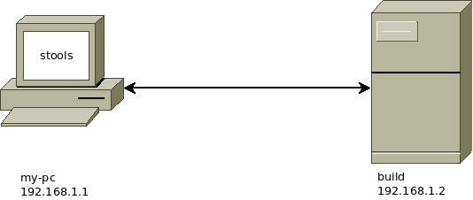

.. stools documentation master file, created by
   sphinx-quickstart on Sun Dec 27 23:07:50 2015.
   You can adapt this file completely to your liking, but it should at least
   contain the root `toctree` directive.

Welcome to stools's documentation!
==================================

What
----

"stools" is a module for Python 2.6+ that help you to automate tasks on machines across network.

Example
-------

For example, if you use `build` as a build machine, you can create a 
stools configuration file (:file:`~/.stools/configuration.cfg` on `my-pc`) like this:

.. code-block:: ini 

  [machines]
    
    [[my-pc]]
    ip = 192.168.1.1
    username = login
    password = passwd

    [[build]]
    ip = 192.168.1.2
    username = login
    password = passwd

  [tasks]
    
    [[build]]

        [[[update_and_build]]]
        machine = "build"
        command = "cd source_code_directory ; git pull ; make"
        
        [[[get_bin]]]
        type = "recovery"
        machine_source = "build"
        machine_target = "my-pc"
        file_source = "source_code_directory/bin"
        file_target = "~/bin"

On `my-pc` you can execute this task by using::

    $ stools -e build

Documentation
-------------

.. toctree::
   conception

   autodoc

Indices and tables
------------------

* :ref:`genindex`
* :ref:`modindex`
* :ref:`search`

